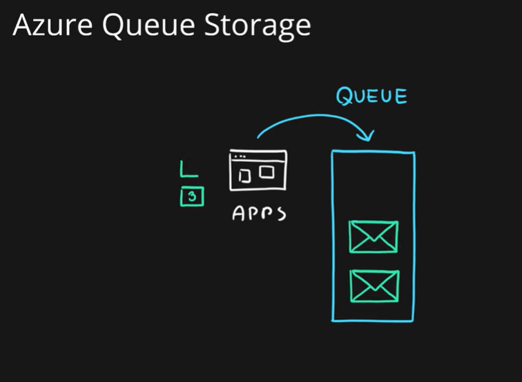
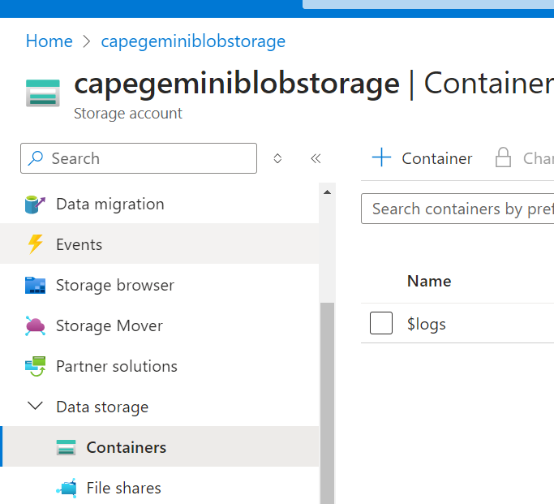
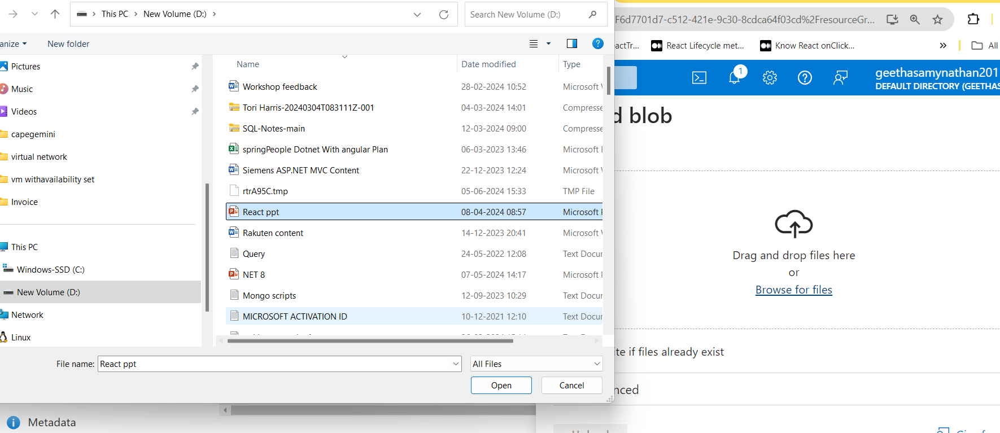
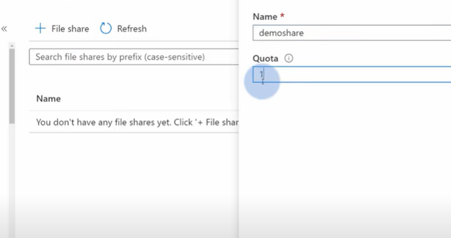

# Storage Account


# structured storage


 # semi structured 


# unstructured  data


# Blob Storage


how it woule be , what kinds of things can store in blob storage


# Queue Storage




# Table Storage (unstructured data Like mongodb,cosmos db)


# File Storage

## comparison of blob and file storage


goto azure portal ==>storage Account ==> create resource group==>


Advance tab


Data protection


review + create
create


goto resource


save 


for blob storage => choose container ==>







this is how we creating blobstroage and uploading the files .for viewing you copy the url paste in browser file will download. we can view from downloads

# blob storage from C#

create storage account in az portal.


create a new project ( .net core web api).

copy the connectionstring from portal paste in notepad

set Environmentvariable using below command

`
setx AZURE_STORAGE_CONNECTION_STRING "<yourconnectionstring>"
`

`
setx AZURE_STORAGE_CONNECTION_STRING "DefaultEndpointsProtocol=https;AccountName=capegeblobstorage;AccountKey=HdLeGUZG28YHJEITidIK3I2MfDfH/ip+R53xGhKFD9QSAP8K0wqeK2eQf5GSsdD90fasXWPNHMlT+AStWNTMiw==;EndpointSuffix=core.windows.net""
`


create api project  ==>Blobquickstartapi

create new controller ==>blob controller==>

needs to install **Azure.Storage.Blobs** from nuget package
``` csharp
using Azure.Storage.Blobs;
using Microsoft.AspNetCore.Mvc;
using System.IO;


namespace BlobQuickstartAPI.Controllers
{
    [Route("api/[controller]")]
    [ApiController]
    public class blobController : ControllerBase
    {
        private static string blobconnectionstring = "DefaultEndpointsProtocol=https;AccountName=capegeblobstorage;AccountKey=HdLeGUZG28YHJEITidIK3I2MfDfH/ip+R53xGhKFD9QSAP8K0wqeK2eQf5GSsdD90fasXWPNHMlT+AStWNTMiw==;EndpointSuffix=core.windows.net";
        private static string containername = "democontainer";
        [HttpPost("[action]")]
     
        public async Task<IActionResult> FileUpload(IList<IFormFile> files)
        {
            
            BlobContainerClient blobContainerClient = new BlobContainerClient(blobconnectionstring, containername);
            foreach (IFormFile file in files)
            {
                using (var stream = new MemoryStream())
                {
                    await file.CopyToAsync(stream);
                    stream.Position = 0;
                     await blobContainerClient.UploadBlobAsync($"SQlFile/{file.FileName}", stream);
                }
            }

         return Ok("File uploaded Successfully!!");
        }

    }
}
```
run your application


# another way you can set through 
goto environment variables


copy the connectionstring from portal paste in notepad

set Environmentvariable using below command

`
setx AZURE_STORAGE_CONNECTION_STRING "<yourconnectionstring>"
`

`
setx AZURE_STORAGE_CONNECTION_STRING "DefaultEndpointsProtocol=https;AccountName=capegeblobstorage;AccountKey=HdLeGUZG28YHJEITidIK3I2MfDfH/ip+R53xGhKFD9QSAP8K0wqeK2eQf5GSsdD90fasXWPNHMlT+AStWNTMiw==;EndpointSuffix=core.windows.net""
`

# File Storage

creating another storage  as i have delete the previous account.

review + create

Allow Blob anonymous access


choose any one the access tier ==>Hot  , cool, tr..


review + create

goto demofileshare ==> connect ==>


copy the script
open powershell in local machine

paste the script


it will create one drive with name we gave
there we can create folder ,file .That will reflect on azure portal too.




if we  want to look all storage inforamtion in local machine 
download and install ==>storage browser for windows 


# Add Queue

add queue


as we set expiration time for bye message 2mins. it is expired


# Azure Disk storage  ==> Price is high


unmanged disk ==> Blob ==> customer needs to take care responsibility


# CDN in storage account
# How does a CDN work?
CDNs are all about caching content and improving user experience. These tasks may sound rather straightforward, but the processes behind them are complex and full of technical wizardry.

# The CDN server
In order to exist, any such vendor needs content caching servers. These CDN servers are grouped into **point of presence** (PoPs) which are then distributed in various geographic locations. The purpose of the network is to **redirect the user to the closest possible PoP**. In most cases, this is done by utilizing the so-called GeoIP, a technology that allows IP address mapping to specific geographic regions, like countries, cities and largely populated areas. Upon processing a request, the network uses the GeoIP technology as a reference to direct the user to the closest available server.


# The content caching process
Any website user can cache their site’s content on a CDN to deliver it to their end-users in a quick, efficient manner. Thanks to this service, the entire process is much faster than if you had to deliver it straight from the source. In other words, **the user’s request to your content will go straight to the nearest possible PoP and back**, rather than traveling to the origin servers and back.
goto storage 
storagename :capegeblobstorage  ==> overview ==> cdn 


upload image in image container


goto storage ==> seach cdn


configure origin


goto cdn overview
copy the url


paste in another tab

for an example if url **https://imagecdnendpoint.azureedge.net**

**https://imagecdnendpoint.azureedge.net/myimage1.jpg**


| Feature    |	 Azure Front Door	|  Azure CDN |
| ---------- | -------------------- | ------------ |
|Primary Function |	Application acceleration |	Content delivery |
|Content Focus	|All content (static and dynamic)|	Static content (images, videos, large files)|
|Key Features |	Caching, intelligent routing, load balancing, WAF	|Caching, global POP network |
| Security |	Integrated Web Application Firewall (WAF) |	Limited security features|
|Routing	|Intelligent routing based on user location, server health, custom rules |	Simpler routing based on content type and origin server|
|Scalability |	Highly scalable for handling large traffic spikes |	Scalable for efficient content delivery |
| Cost |	Per rule set (potentially higher for complex configurations)|	Per bandwidth usage and storage|
|Ideal Use Case|	Global applications with complex routing and security needs	|Websites and applications requiring fast delivery of static content|